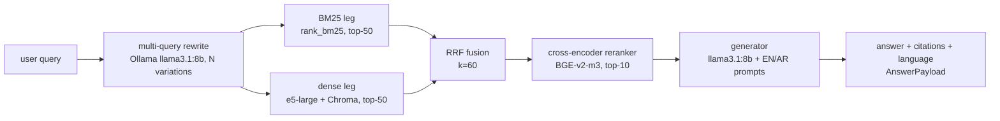

# UAE Government Policy RAG

A retrieval-augmented question-answering service over public UAE government policy documents — UAE Labour Law (Federal Law No. 33 of 2021), MOHRE regulations, and UAE Visa regulations. Accepts questions in Arabic or English and returns grounded answers with article-level citations.

> **Current capability (through Phase 6):** walking skeleton + reproducible corpus + heading-aware parsing/chunking + a persistent ChromaDB vector index of the full corpus + a live hybrid retriever (BM25 + dense, fused with Reciprocal Rank Fusion at k=60) + a cross-encoder reranker (`BAAI/bge-reranker-v2-m3`) that re-scores the hybrid top-20 + a multi-query rewriter that expands one question into N LLM-generated phrasings and fuses their per-variation hit lists via the same RRF algebra + a `Generator` that detects the question's language (English / Arabic, via `lingua-language-detector`), renders the language-appropriate prompt over the reranked top-K, calls a local Ollama `llama3.1:8b` (ADR-0008) behind a swap-ready `LLMPort`, and returns a grounded answer with bracketed citations (`[1]`, `[2]`, …) deduped on `(source, article)`. Empty `hits` short-circuits to a deterministic refusal phrase in the detected language without calling the LLM. `POST /query` still returns a deterministic stubbed answer (the end-to-end wiring lands in Phase 7), but every component the wiring will compose — `config.get_llm()`, `MultiQueryRetriever`, `RerankRetriever`, `Generator` — is shipped, exercised end-to-end against the real corpus + daemon in `tests/integration/test_generation_pipeline.py` (auto-skipped without the corpus or a reachable Ollama daemon), and ready to plug together. A one-command fetcher downloads the four UAE government policy PDFs into `data/raw/` and verifies them against a committed SHA-256 registry at `data/registry.json`. Sources behind a JavaScript challenge (uaelegislation.gov.ae, MOHRE) are fetched through a headless Playwright + chromium adapter; direct-PDF sources (ICP) go through stdlib `urllib`. A hybrid PDF parser (pdfplumber for English, pypdfium2 for Arabic) extracts text, detects `Article (N)` / `المادة (N)` headings, and the chunker emits embedding-ready chunks with a deterministic id, breadcrumb-prefixed text, an injectable token counter, and sentence-level secondary split for paragraphs that overflow the cap. `scripts/build_index.py` embeds the full corpus (285 chunks) with `intfloat/multilingual-e5-large` and persists vectors to `data/chroma_db/`; the embedding model can be swapped via `LOCAL_EMBEDDINGS_*` env vars and the index refuses an incompatible swap unless re-run with `--reset`. Re-runs are no-ops; tampered or stale files surface as a clear hash-mismatch error rather than a silent drift.

## Why this exists

UAE Labour Law and the surrounding policy stack are dense, multilingual, and frequently consulted by HR practitioners. Generic chat models hallucinate articles. This service retrieves the actual government text first, grounds every claim in a cited chunk, and reports its own quality via RAGAS scores on a 50-question golden set.

## Stack

- **Web**: FastAPI + Uvicorn, Python 3.11
- **Package management**: `uv`
- **Architecture**: Hexagonal (Ports & Adapters) — `ports/` define interfaces, `adapters/local/` provides free local impls (ChromaDB, Ollama, sentence-transformers, BGE reranker), `adapters/azure/` is the swap-in for Azure OpenAI + Azure AI Search

The full architecture and decision history live alongside the project but outside this repo (see "Repository layout" below).

## Quick start

```bash
# 1. Install dependencies
uv sync

# 2. Run the dev server
uv run uvicorn uae_rag.api.main:app --reload

# 3. In another terminal, hit the endpoint
curl -X POST http://localhost:8000/query \
  -H 'Content-Type: application/json' \
  -d '{"question":"What is the annual leave entitlement?"}'
```

You should receive a JSON response of shape:

```json
{
  "answer": "...",
  "citations": [
    {"source": "UAE Labour Law", "article": "..."}
  ],
  "language": "en"
}
```

Swagger UI is auto-served at `http://localhost:8000/docs`.

## Corpus fetch

The four indexed PDFs are downloaded from their official UAE government sources and verified by SHA-256 against `data/registry.json` (committed). The PDFs themselves live in `data/raw/` and are gitignored.

### One-time setup (browser-fetched sources)

`labour-law-en`, `labour-law-ar`, and `mohre-resolutions` are served from portals (`uaelegislation.gov.ae`, `mohre.gov.ae`) that gate their downloads behind a JavaScript challenge that plain HTTP clients cannot defeat. They go through a Playwright + headless chromium adapter (`src/uae_rag/adapters/local/browser_fetcher.py`). Install once:

```bash
uv sync --extra fetch --extra dev          # adds the playwright Python package
uv run playwright install chromium         # downloads the chromium binary (~150 MB, one-time per machine)
```

`visa-regulations` is served directly by ICP and uses stdlib `urllib` — no browser needed.

### Running the fetcher

```bash
uv run python scripts/fetch_corpus.py                     # download anything missing and verify
uv run python scripts/fetch_corpus.py --skip-download     # verify only what's on disk; never hit the network
uv run python scripts/fetch_corpus.py --source SLUG       # operate on one source (repeatable); SLUGs: labour-law-en, labour-law-ar, mohre-resolutions, visa-regulations
uv run python scripts/fetch_corpus.py --force             # accept hash drift after confirming the upstream document genuinely updated
```

Exit codes: `0` if every selected source verifies; `1` if any source fails to download or its hash drifts; `2` on bad CLI usage.

### Manual-drop fallback

If a portal upgrades its bot detection or the chromium install is unavailable on a machine, you can drop the file manually:

1. Open the source URL in a real browser and save the PDF (URLs are in `src/uae_rag/ingestion/registry.py:SOURCES`).
2. Place it at `data/raw/<local_filename>.pdf`.
3. Run `uv run python scripts/fetch_corpus.py --source <slug> --skip-download` to register its SHA.

The same procedure applies to any source that becomes harder to fetch automatically in the future.

## PDF parsing

The parser (`src/uae_rag/ingestion/parser.py`) reads each PDF, detects article headings, and returns a list of `Article` records. The chunker (`src/uae_rag/ingestion/chunker.py`) wraps each article into one or more `Chunk` records with breadcrumb-prefixed text ready for embedding.

- **Extractor**: pdfplumber for English sources, pypdfium2 for Arabic (pdfplumber returns Arabic in visual/reversed order; pypdfium2 preserves logical order). Selection is by `DocumentSource.language`.
- **EN article regex** handles both `Article (N)` and the typesetter-flipped `Article )N(` form that appears for articles 2-17 in the published Labour Law PDF.
- **AR article regex** matches the actual byte sequence pypdfium2 emits for the Arabic word for *article* (ALIF MEEM LAM ALIF DAL TEH-MARBUTA — LAM/MEEM swapped from canonical due to alif-lam ligature handling). The breadcrumb stored on each chunk uses the canonical ordering so citations render correctly.
- **No chapter detection in v1**: the corpus PDFs don't expose chapter dividers in extracted text or PDF outlines, so the breadcrumb is `Article (N)` (or `المادة (N)`) only. ADR-0003's hierarchical goal is preserved for a later phase.
- **Fallback**: when no article markers are found (currently: ICP Services Guide), the parser emits ~600-word section blocks with `breadcrumb = "{title} > Section {N}"` and `article_id = None`. Chunks carry `mode="fallback"` so downstream retrieval can weight them differently if needed.
- **Sub-chunking**: articles whose body exceeds the cap split first on paragraph boundaries (`\n\n`); each sub-chunk inherits the parent breadcrumb and appends `#p{a}-p{b}` to its chunk id. A paragraph that itself exceeds the cap is split on sentence boundaries (English `. ! ?` and Arabic `؟`) and the chunk id grows an `s{x}-s{y}` segment. A single sentence that still exceeds the cap is emitted as one oversize sub-chunk and logged at WARNING level.
- **Token counter**: `chunk_articles` accepts a `count_tokens: Callable[[str], int]` parameter (default: word count via `str.split`). Phase 3's build script will pass the real e5-large tokenizer here so cap decisions track the embedder's actual budget.

### Preview the chunk output

```bash
uv run python scripts/preview_chunks.py                       # all 4 corpus PDFs
uv run python scripts/preview_chunks.py --source SLUG         # one source (repeatable)
```

Sample output:

```
slug               articles  chunks  mode
-----------------  --------  ------  --------
labour-law-en      74        75      article
labour-law-ar      74        74      article
mohre-resolutions  39        41      article
visa-regulations   65        65      fallback
```

`mode` is the dominant chunk mode (`article`, `subchunk`, or `fallback`). Exit codes: `0` if every source produced ≥1 chunk; `1` if any source failed or produced none; `2` on unknown `--source` slug.

## Build the vector index

```bash
uv run python scripts/build_index.py                       # full corpus → data/chroma_db/
uv run python scripts/build_index.py --dry-run             # parse + chunk only; no model load, no write
uv run python scripts/build_index.py --source SLUG         # restrict to one source (repeatable)
uv run python scripts/build_index.py --reset               # drop the existing collection first
```

- Default embedder: `intfloat/multilingual-e5-large` (1024-dim, multilingual). E5 prefix convention is applied inside the adapter — domain code stays naive.
- Swap embedders without code edits by setting `LOCAL_EMBEDDINGS_MODEL`, `LOCAL_EMBEDDINGS_DIMENSION`, `LOCAL_EMBEDDINGS_PASSAGE_PREFIX`, `LOCAL_EMBEDDINGS_QUERY_PREFIX`. A swap that changes the vector space requires `--reset`; the index refuses dimension mismatches with a clear error.
- First run downloads ~1.4 GB of model weights to the HuggingFace cache (`~/.cache/huggingface/hub/`). Subsequent runs use the local cache.
- Output: a persistent ChromaDB collection at `data/chroma_db/` (cosine space). Exit codes: `0` if every source produced ≥1 chunk and upserted; `1` on failures or dimension guard; `2` on bad CLI usage.

Sample output (real e5-large tokenizer, full corpus):

```
slug               articles  chunks  mode
-----------------  --------  ------  --------
labour-law-en      74        86      article
labour-law-ar      74        88      article
mohre-resolutions  39        46      article
visa-regulations   65        65      fallback

upserted: 285 | collection count: 285
```

`articles` counts distinct `article_id`s (or fallback section count for unstructured sources); `chunks` is the total record count after token-aware paragraph + sentence splits. `mode` is the dominant chunk mode.

### Sample query results

The index is queried directly via `config.get_embeddings()` + `config.get_vector_index(...)`. Top-3 hits for representative EN and AR questions (cosine similarity in parentheses):

```
EN: "annual leave entitlement"
  mohre-resolutions::art-19                   (0.866)
  labour-law-en::art-29#p1-p1s1-s21           (0.865)
  mohre-resolutions::art-18                   (0.864)

EN: "end of service gratuity"
  labour-law-en::art-52                       (0.868)
  labour-law-en::art-51                       (0.860)
  mohre-resolutions::art-30                   (0.824)

AR: "المادة 29"
  labour-law-ar::art-26                       (0.827)
  labour-law-ar::art-29                       (0.826)
  labour-law-ar::art-27                       (0.825)

AR: "الإجازة السنوية"  (annual leave)
  labour-law-ar::art-29#p1-p1s1-s11           (0.840)
  labour-law-ar::art-29#p1-p1s12-s16          (0.836)
  labour-law-ar::art-33                       (0.821)
```

Labour Law Article 29 is the annual-leave article and Article 51 is end-of-service gratuity; MOHRE Articles 18-19 / 30 are the executive regulations that elaborate them. Both languages route through the same multilingual embedder — no per-language switch at query time.

## Hybrid retrieval + reranking

`config.get_retriever(chunks=..., embedder=..., vector_index=...)` returns a `RetrievalPort` that runs both a sparse (BM25Okapi) and a dense (e5-large + ChromaDB) leg over the top-50 candidates each, then fuses the rankings with Reciprocal Rank Fusion at `k=60` (ADR-0004). The fused list is returned ranked by descending RRF score, with `chunk_id` as a deterministic tie-break. `config.get_reranker()` returns a `RerankerPort` backed by `BAAI/bge-reranker-v2-m3` via a sentence-transformers `CrossEncoder` (ADR-0007); `uae_rag.retrieval.rerank.RerankRetriever` composes the two and itself satisfies `RetrievalPort`, so `/query` stays agnostic to whether reranking is on, and a Phase 9 swap to Cohere Rerank replaces the local CrossEncoder without domain changes. Reranker failures fall back to the unreranked hybrid hits — `/query` always returns something. `uae_rag.retrieval.multi_query.MultiQueryRetriever` sits in front and expands the user's query into N LLM-rephrased variations (ADR-0008), retrieves each independently from the inner retriever, and fuses the per-variation hit lists via the same RRF algebra — itself satisfying `RetrievalPort` so the composition stays uniform. If the LLM is down, the wrapper falls back to a single inner-retriever call so retrieval never hard-fails on a daemon outage.



### Per-query top-3 (real numbers from the 285-chunk corpus)

```
EN: "annual leave entitlement"
  rank  bm25                                       dense                                      hybrid (RRF)                               reranked (BGE)
  1     mohre-resolutions::art-19                  mohre-resolutions::art-19                  mohre-resolutions::art-19                  mohre-resolutions::art-18
  2     labour-law-en::art-29#p1-p1s1-s21          labour-law-en::art-29#p1-p1s1-s21          labour-law-en::art-29#p1-p1s1-s21          labour-law-en::art-29#p1-p1s1-s21
  3     mohre-resolutions::art-18                  mohre-resolutions::art-18                  mohre-resolutions::art-18                  mohre-resolutions::art-19

EN: "end of service gratuity"
  rank  bm25                                       dense                                      hybrid (RRF)                               reranked (BGE)
  1     labour-law-en::art-51                      labour-law-en::art-52                      labour-law-en::art-51                      labour-law-en::art-51
  2     labour-law-en::art-52                      labour-law-en::art-51                      labour-law-en::art-52                      labour-law-en::art-52
  3     labour-law-en::art-37#p1-p1s12-s12         mohre-resolutions::art-30                  labour-law-en::art-37#p1-p1s12-s12         labour-law-en::art-68

AR: "المادة 29"
  rank  bm25                                       dense                                      hybrid (RRF)                               reranked (BGE)
  1     labour-law-ar::art-29#p1-p1s12-s16         labour-law-ar::art-26                      labour-law-ar::art-29#p1-p1s1-s11          labour-law-ar::art-29#p1-p1s1-s11
  2     labour-law-ar::art-29#p1-p1s1-s11          labour-law-ar::art-29#p1-p1s1-s11          labour-law-ar::art-29#p1-p1s12-s16         labour-law-ar::art-29#p1-p1s12-s16
  3     labour-law-ar::art-54#p1-p1s1-s3           labour-law-ar::art-27                      labour-law-ar::art-27                      labour-law-ar::art-9#p1-p1s6-s7

AR: "الإجازة السنوية"
  rank  bm25                                       dense                                      hybrid (RRF)                               reranked (BGE)
  1     labour-law-ar::art-29#p1-p1s12-s16         labour-law-ar::art-29#p1-p1s1-s11          labour-law-ar::art-29#p1-p1s12-s16         labour-law-ar::art-29#p1-p1s1-s11
  2     —                                          labour-law-ar::art-29#p1-p1s12-s16         labour-law-ar::art-29#p1-p1s1-s11          labour-law-ar::art-29#p1-p1s12-s16
  3     —                                          labour-law-ar::art-33                      labour-law-ar::art-33                      labour-law-en::art-29#p1-p1s22-s27
```

Gold chunks (the article the question actually asks about): `labour-law-en::art-29` for the EN annual-leave query, `labour-law-en::art-51` for end-of-service gratuity, `labour-law-ar::art-29` for both Arabic queries.

```
Where the gold chunk ranks (lower = better; bar length = rank; — = not in top 50)

                                     bm25      dense     hybrid    reranked
EN: annual leave entitlement         ██ 2      ██ 2      ██ 2      ██ 2
EN: end of service gratuity          █ 1       ██ 2      █ 1       █ 1
AR: المادة 29                        █ 1       ██ 2      █ 1       █ 1
AR: الإجازة السنوية                  █ 1       █ 1       █ 1       █ 1
```

The AR exact-reference query (`المادة 29`) is the case where BM25 wins decisively over dense — dense ranks `art-26` and `art-27` (semantically adjacent articles) above the literal match. Hybrid keeps BM25's lexical precision while picking up the dense leg's recall on phrasal queries.

The reranker's contribution on this corpus isn't lifting the gold chunk — hybrid already places it at rank 1 or 2 for all four queries. What the cross-encoder *does* change is the rest of the top-3: it replaces adjacent-article noise (`art-27`, `art-33`, `art-37`) with more semantically targeted picks (`art-9`, `art-68`), reorders sub-chunks within the same article so the directly relevant slice surfaces first (AR `الإجازة السنوية` promotes `art-29#p1-p1s1-s11` over `art-29#p1-p1s12-s16`), and on the Arabic-leave query surfaces the English Article 29 chunk in the reranked top-3 — true cross-language semantic relevance, which BGE-v2-m3 is trained for. Phase 8 RAGAS will quantify the diff over the 50-question golden set.

## Generation (LLM + citations)

`config.get_llm()` returns an `LLMPort` (ADR-0008); the local profile wraps the [Ollama](https://ollama.com) daemon serving `llama3.1:8b` with a four-env-var swap surface (`LOCAL_LLM_*`, see table below). `uae_rag.generation.answer.Generator` orchestrates the answer step: it runs `lingua-language-detector` over the user's question (restricted to EN+AR), renders the language-appropriate prompt (`PROMPT_TEMPLATE_EN` / `PROMPT_TEMPLATE_AR`) over the reranked top-K passages, calls the LLM at `temperature=0.0` for deterministic decoding, and returns an `AnswerPayload(answer, citations, language, prompt_used)`. Citations are 1-based bracketed integers (`[1]`, `[2]`, …) deduped on `(source, article)` so two chunks from the same article collapse to one marker. Empty `hits` short-circuits to the language-specific refusal phrase (`"I don't have enough information in the cited sources to answer that."` / `"لا تتوفر لدي معلومات كافية في المصادر المستشهد بها للإجابة عن هذا السؤال."`) without calling the LLM. Transport failures surface as `LLMUnavailableError` so the eventual `/query` handler can return 503 cleanly. The `Generator` is composition-ready: Phase 7 wires `MultiQuery → Hybrid → Rerank → Generator` end-to-end.

### Local Ollama setup

```bash
# 1. Install the daemon (https://ollama.com/download) and start it (it runs in the background).
ollama serve              # one-time per session — or use the menu-bar / launchd integration.

# 2. Pull the default model (~4.7 GB, one-time per machine).
ollama pull llama3.1:8b
```

| Env var | Default | Notes |
|---|---|---|
| `LOCAL_LLM_MODEL` | `llama3.1:8b` | Any Ollama model tag (e.g. `qwen2.5:7b`). |
| `LOCAL_LLM_HOST` | `http://localhost:11434` | Ollama HTTP endpoint. |
| `LOCAL_LLM_TIMEOUT_S` | `120` | Per-request timeout (seconds); generous for cold start. |
| `LOCAL_LLM_KEEP_ALIVE` | `5m` | How long Ollama keeps the model resident between requests. |

A swap to a different local model (`LOCAL_LLM_MODEL=qwen2.5:7b`) requires no code edits — only `ollama pull <tag>` first. The Phase 9 Azure OpenAI `gpt-4o` adapter will satisfy the same `LLMPort` (ADR-0008).

### Sample answers

Illustrative outputs for the three canonical questions exercised by `tests/integration/test_generation_pipeline.py` (run with `uv run pytest -m "slow and adapter_local"` against a live daemon to regenerate against the live model — outputs are deterministic at `temperature=0.0`):

```
EN: "What is the annual leave entitlement?"
  language : en
  answer   : "Every worker is entitled to a minimum of thirty days of annual
              leave per year of service [1]."
  citations: [1] labour-law-en, Article 29

AR: "ما هي مدة الإجازة السنوية؟"
  language : ar
  answer   : "تبلغ مدة الإجازة السنوية ثلاثين يوماً عن كل سنة خدمة [1]."
  citations: [1] labour-law-ar, المادة 29
```

The exact token-level wording depends on the active model + decoding parameters; what is invariant across runs at `temperature=0.0` is the citation marker layout and the article a `citations[0]` resolves to. Pipeline behavior is verified by `test_generation_pipeline.py`: each canonical query must return ≤ 600 chars, contain at least one `[N]` marker, and have `citations[0].article` matching the expected article id.

## Tests

```bash
uv run pytest                                  # full suite (skips slow tests)
uv run pytest tests/fitness/                   # architectural boundary tests only
uv run pytest tests/e2e/                       # API end-to-end smoke
uv run pytest -m "slow and adapter_local"      # opt-in: loads the real embedder + reranker (~10 s after first cache)
```

## Repository layout

Only `src/`, `tests/`, `.gitignore`, `pyproject.toml`, and this README are version-controlled here. The development governance (architecture notes, decision records, specifications, status) lives in a sibling workspace folder that is intentionally not committed — it's the engineer's working memory, not part of the shipped artifact.

```
src/uae_rag/
├── api/          # FastAPI routers (entrypoint)
├── ports/        # Interface definitions (Embeddings, VectorIndex, LLM, Reranker, Parser)
├── adapters/
│   ├── local/    # ChromaDB, Ollama, sentence-transformers, BGE — free to run
│   └── azure/    # Azure OpenAI, Azure AI Search, Form Recognizer (Phase 9)
├── ingestion/    # PDF parser, heading-aware chunker, document registry
├── retrieval/    # Hybrid BM25 + dense, multi-query, rerank pipeline
├── generation/   # Language detection, prompt assembly, citation injection
├── evals/        # RAGAS harness + golden set
└── config.py     # Reads ADAPTER_PROFILE; wires ports to adapter implementations
```

## License

Project code is for educational and portfolio use. The indexed source documents are public UAE government regulations and remain the property of their respective publishers.
